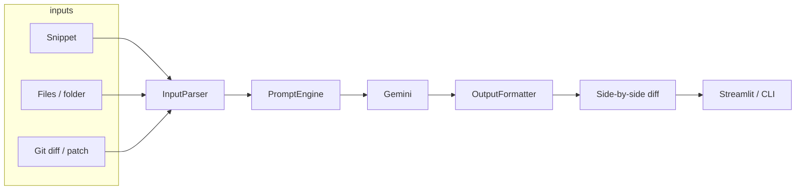

# BugSense

**AI bug analyst for students and developers.** Paste a snippet, upload a small project, or send a git diff. BugSense classifies the failure, explains the root cause, and shows a **line-by-line patch** next to your original code.

It is an LLM workflow on [Google Gemini](https://ai.google.dev/) — not a local compiler or linter. Submitted source is sent to Google’s API.

[Code walkthrough](CODE_WALKTHROUGH.md) · [License](LICENSE)


---

## Why BugSense

Most “AI fix my code” tools dump a new file and hope you trust it. BugSense is built around **understanding and verification**:

| You get | Why it matters |
| --- | --- |
| **Bug type** | A category (off-by-one, null dereference, cross-file contract, or `None`) |
| **Root cause** | A trace of *why* it fails, including caller/callee issues across files |
| **Corrected code** | Full updated source, not a partial snippet |
| **Side-by-side diff** | Red = removed, green = added — compare before you copy |

---

## Features

- **Three input modes:** snippet, multi-file project (analyze together by default), unified / `git diff`
- **Languages:** Python, Java, C/C++, JavaScript/TypeScript, Go, Rust, C#, Ruby, PHP, SQL, Kotlin, Swift
- **Safety rails:** line/file budgets, function-level chunking for oversized files, heuristic secret redaction
- **Resilient API layer:** missing-key guard, empty-response checks, exponential backoff on 429/5xx
- **Two clients, one pipeline:** Streamlit UI and a CLI (`main.py`) share parser → prompt → Gemini → formatter → diff
- **Tests** for parsing, prompts, diffs, and compare logic (no live API in CI)

---

## Architecture



Deep, file-by-file explanation: **[CODE_WALKTHROUGH.md](CODE_WALKTHROUGH.md)**.

---

## Deploy

The public app is `streamlit_app.py`. Never put `GEMINI_API_KEY` in git. Hosted platforms keep it in their secret store; the app copies Streamlit secrets into the environment for the Gemini client.

**A path on your laptop cannot be used for `git diff` in the cloud.** Use paste, file upload, or an uploaded `.diff` / `.patch`.

### Option A — Streamlit Community Cloud (easiest, free)

1. Push this repo to GitHub (the branch you want live, often `main`).
2. Open [share.streamlit.io](https://share.streamlit.io) and sign in with GitHub.
3. **Create app** → repository, branch, main file `streamlit_app.py`.
4. **Settings → Secrets** (TOML):

```toml
GEMINI_API_KEY = "your_key_here"
# optional
# GEMINI_MODEL = "gemini-3-flash-preview"
```

5. Deploy. You get a URL like `https://<app-name>.streamlit.app`.

The Cloud installer uses `requirements.txt` and `packages.txt` (`git`).

### Option B — Docker (VPS, Railway, Fly.io, Cloud Run)

```bash
docker build -t bugsense .
docker run --rm -p 8501:8501 -e GEMINI_API_KEY=your_key_here bugsense
```

Open port 8501. Set the key as a **runtime** environment variable, not a Docker build argument.

### Option C — Hugging Face Spaces

New **Streamlit** Space from this repo, add `GEMINI_API_KEY` under **Settings → Secrets**, app file `streamlit_app.py`.

---

## Quick start

**Requirements:** Python 3.12+, [uv](https://docs.astral.sh/uv/), a [Gemini API key](https://aistudio.google.com/apikey).

```bash
git clone https://github.com/aliza-imran25/BugSense.git
cd BugSense
uv sync --group dev
cp .env.example .env
```

Edit `.env`:

```
GEMINI_API_KEY=paste_your_key_here
```

Optional: `GEMINI_MODEL=...` (default `gemini-3-flash-preview`). Never commit `.env`.

### Web UI

```bash
uv run streamlit run streamlit_app.py
```

Open [http://localhost:8501](http://localhost:8501).

| Tab | Use when |
| --- | --- |
| **Paste Code** | One function or file in the clipboard |
| **Multi-file** | Imports / types disagree across modules |
| **Diff** | You already have a patch or a dirty git tree |

### CLI

```bash
# Single file
uv run python main.py path/to/buggy.py -e "TypeError: ..."

# Several files as one project
uv run python main.py src/util.py src/app.py -e "AssertionError"

# Each file separately
uv run python main.py --per-file src/util.py src/app.py

# Working tree vs HEAD
uv run python main.py --diff
uv run python main.py --diff main --repo /path/to/project
uv run python main.py --diff --staged
uv run python main.py --patch changes.diff
```

With no arguments, the CLI prompts you to paste code (or a diff) and finish with a line containing only `END`.

---

## Limits and privacy

| Limit | Value |
| --- | --- |
| Lines per file | 400 (then chunk by top-level `def`/`class`/`function` when possible) |
| Files per request | 20 |
| Bundle / diff | 1600 lines total / 1500 diff lines |
| Payload | 500 KB UTF-8 |

Assignments that look like `api_key`, `token`, `password`, or `secret` are replaced with `***REDACTED***` before the request. Treat this as a convenience, not a compliance control.

**Do not paste proprietary or production secrets.** Code you submit is sent to Google.

---

## Project layout

```
BugSense/
├── streamlit_app.py      # Web UI
├── main.py               # CLI
├── input_parser.py       # Language, limits, bundles, diffs
├── prompt_engine.py      # System + user prompts
├── agent.py              # Gemini client and retries
├── output_formatter.py   # Parse [Bug Type] / [Root Cause] / [Corrected Code]
├── code_compare.py       # Red/green side-by-side
├── git_diff.py           # git diff --no-color
├── tests/                # pytest
├── CODE_WALKTHROUGH.md   # Full source explanation
├── requirements.txt      # For Streamlit Cloud / Docker
├── Dockerfile
└── pyproject.toml
```

---

## Development

```bash
uv sync --group dev
uv run pytest
```

Python 3.12 is required (`requires-python` in `pyproject.toml`).

---

## License

MIT © 2026 [aliza-imran25](https://github.com/aliza-imran25). See [LICENSE](LICENSE).
